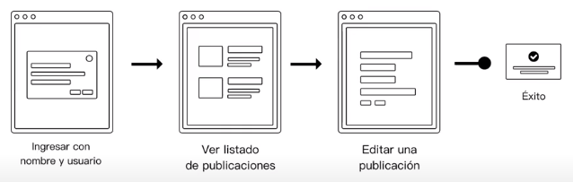

# Checklist de conceptos para entender el User Interface Design

    
    

- [ ] Bases del diseño UI [Go](#id1)
<!-- - [ ] Diferencias entre UX y UI  [Go](#id2) -->
- [ ] Diseño UI vs UX vs Front End  [Go](#id2)
- [ ] Diseño UI vs Diseño gráfico  [Go](#id3)
- [ ] Diseño para Webs vs Apps vs WebApps  [Go](#id5)
- [ ] Proceso del diseño UI  [Go](#id6)
- [ ] Herramientas del diseño UI  [Go](#id7)
- [ ] Del diseño aplicados al UI  [Go](#id8)
- [ ] Elementos de una interfaz  [Go](#id9)
- [ ] Principio UI: Claridad  [Go](#id10)
- [ ] Principio UI: Reglas de Usabilidad  [Go](#id11)
- [ ] Patrones de diseño  [Go](#id12)
- [ ] Sistemas de diseño  [Go](#id13)
- [ ] Claves para un buen diseño UI  [Go](#id14)
- [ ] ...

## Bases del diseño UI 

El diseño UI por sus siglas User Interface es un concepto en el desarrollo de experiencias e interfaz. Pero, ¿Qué es una interfaz? Una interfaz es algo (generalmente un dispositivo) que transforma señales generadas por un aparato en señales comprensibles por otro. 

El diseño UI establece las bases para la comunicación entre un dispositivo y un usuario... Parecería redundante pero un usuario es la persona que usa habitualmente un servicio.

En este contexto (diseño digital de interfaces) tenemos que definir como tal la interfaz de usuario, ¿que es una interfaz de usuario? Es un medio que permite a una persona comunicarse con un sistema digital para recibir e ingresar información así como de dar instrucciones al sistema. Esto nos lleva al concepto de GUI, o Graphic User Interface que es digamos un conjunto dentro del diseño UI que a su vez está dentro del diseño UX. Un ejemplo claro y conciso son los videojuegos, los videojuegos son GUI, todos los elementos son gráficos y construidos para que el mínimo de edad posible entienda las mecánicas y la simbología dentro del mismo juego, como Mario o Sonic.

## Diseño UI vs UX vs Front End 

UX significa User Experience, esto es como un usuario puede interactuar con una marca y/o producto y cómo a partir de esta interacción se tienen distintos resultados positivos o negativos al momento de usar la marca/producto.

El diseño UI es un subconjunto del diseño UX:

sin embargo y a pesar de todo, el diseño UI es la parte que el usuario final como cliente de nuestra plataforma y/o servicio va a ser el consumidor final de la interfaz de usuario. 

UI≠UX

El front end a su vez es la pare de desarrollo del código que como tal construye la parte frontal o visible de una interfaz digital como lo es una página web. 

Los desarrolladores front end se ayudan de los diseños hechos por el equipo de UI que hacen los prototipos en herramientas como Figma, el desarrollador Front end ocupa HTML5,  CSS3 y JS ECM6 para hacer el diseño de Figma real para poderlo presentar como una página dinámica hacia los usuarios clientes.

El diseño UI o GUI interactúa con muchas otras areas de la creación de productos, lo que hace que sus limites no sean claros o precisos para todos. Quien diseñe interfaces digitales no necesita dominar todas las areas, Pero debe saber como las demás areas interactúan en la suya y como la suya interactúa con las demás areas. Por eso existen personas que ponen en su CV Diseñador UI/UX .-.

El diseñador UI no tiene que ser experto en nada, sin embargo si saber los fundamentos de fotografía, iluminación, composición, redacción y más. 

Es cierto que el diseño gráfico no es lo mismo que el diseño UI, sin embargo van de la mano para poder lograr ser de alguna forma una mancuerna de conocimientos disponibles para poder diseñar de forma adecuada una interfaz de usuario mediante la composición, análisis de color y más técnicas del diseño gráfico.

## Diseño para Webs vs Apps vs WebApps 

Estrictamente es distinto lo que como usuarios podemos encontrar en una Web a lo que como usuarios podemos encontrar en
una App. Por ejemplo, hablando desde la generalización:

La intención de un usuario al entrar a un sitio web es Acceder a información.

La intención de un usuario al entrara a una App es la de Realizar una tarea específica

Esto nos ha llevado a desarollar un estandar de niveles de complejidad para las interfaces de usuario:

### Niveles de complejidad de un diseño

1. Mostrar información (páginas estáticas y dinámicas sin Datastore)
2. Mostrar información personalizada (gestión de usuarios)
3. Capturar y mostrar información personalizada (interacción con la plataforma para completar una tarea).

## Proceso de diseño UI 

1. Proceso de negocio:
Necesitamos entender lo que hace el negocio, cómo lo hace y para qué lo hace. 

Para ayudarnos a entender eso ocupamos un modelo operacional básico. en palabras más simples esta etapa se trata de identificar que es lo que le importa o que prioriza el cliente, si nuestro cliente es una empresa de noticias van a prorizar cómo se ve la información de tipo texto, si fuera nuestro cliente un youtuber el priorizará de manera distinta la información de tipo texto y la visual. Nosotros como diseñadores UI necesitamos hacer que una interfaz de un proceso se digitalice y/o sea lo suficientemente clara para el usuario

2. User persona:
Necesitamos crear un perfil del usuario ideal de tu interfaz,  con sus deseos y necesidades.

Los perfiles ficticios que necesitamos crear van a ser usuarios potenciales de la plataforma, ya que siempre deben ser creados enfocándose al target de nuestra plataforma, es decir que si estamos diseñando una interfaz para un banco no vamos a introducir elementos vistosos para fomentar las distracciones como lo haría una aplicación recreativa. esto nos ayudará a que cuando estemos diseñando la plataforma en el siguinete paso siempre tengamos fresco nuestro target no solo para nuestro equipo de diseño si no para los demás equipos.

3. Screen Flow: 
Necesitamos entender las pantallas que el usuario verá en su flujo de trabajo.

Para lograr esto podemos hacer un mapa de contenidos del sitio, es decir que botón o palabra clave que introduciremos al botón nos va a llevar a dónde, y de qué manera estará jerarquizada esa información. Por ejemplo, nuestro target son las personas que quieren aprender programación, dentro de la página en inicio debemos situar un botón que diga "Contenido", dentro necesitamos poder ver el blog con los post más recientes, separado a su vez de los tutoriales, que estarán separados por los cursos formales que estarán divididos por lenguajes. De esta forma tendríamos correctamente jerarquizada y priorizada la información.

Para aplicaciones podemos hacer este tipo de screen flow a manera de flujo de pantallas sencillo como el siguiente:

Este paso nos ayuda a identificar que pantallas se tienen que diseñar para poder realizar un diseño correcto de nuestra plataforma, aplicación o webpage.

4. Wireframes: 
Necesitamos especificar una vista rápida de los bloques que construyen cada pantalla.

Para este paso necesitamos reconocer los apartados funcionales y de interacción con el usuario así como de especificar pensando en las proporciones los elementos multimedia que necesitamos colocar en nuestra página web, esto provocará que en el siguiente paso podamos hacer un diseño fiel a lo que se debería de presentar. Los wireframes deben contener las especificaciones de los botones y capacidad de interacción con el usuario.

5. Diseño de alta fidelidad:
Necesitamos concretar un diseño visual, tal cual es específicamente cómo lo va a ver el usuario y cómo va a interactuar con el ya que es la capa superior que pone en la mesa el diseño final.

- Arounda: UX/UI & WEB. Product Design Agency: SaaS, B2B. UX/UI, Mobile & Web Design.

Dentro de esta parte se pone en pie cada uno de los elementos que van a formar parte de este diseño de la forma más cercana posible a la forma en la que van a quedar cuando se diseñe con código.

6. Prototipado:
Necesitamos presentar un prototipo semi funcional que sirve para presentar el diseño y obtener feedback.

Ocupamos el producto creado por el paso anterior, el diseño de alta fidelidad, sin embargo a este le vamos a agregar cierta funcionalidad específica para simular las interacciones usuario-plataforma.

7. Feedback:
En esta etapa necesitamos escuchar los comentarios de la parte técnica de la compañía, ya sea la del Product Owner o la del Product Manager y quizás hasta la de nuestro Scrum Master ya que necesitamos saber si todo nuestro diseño encaja en el presupuesto de tiempos de entrega, costes de producción y capital humano (es decir si hay la gente en el equipo que pueda llevar nuestro diseño a código) Así mismo nuestro cliente nos debe de dar una evaluación si el prototipo es correcto y funcional, no necesariamente tiene que ser el cliente final, pueden ser clientes potenciales o users persona reales que sean usuarios potenciales de nuestra plataforma o aplicación

8. Entrega:
En esta parte se hace la entrega al equipo de desarrollo de todos los productos que se realizaron al momento de diseñar la interfaz. Todo esto depende de cómo se acuerde con el equipo de desarrollo. Necesitamos enterarnos de nuestros protocolos de entrega para cada empresa ya que pueden ser más o menos estrictos.

